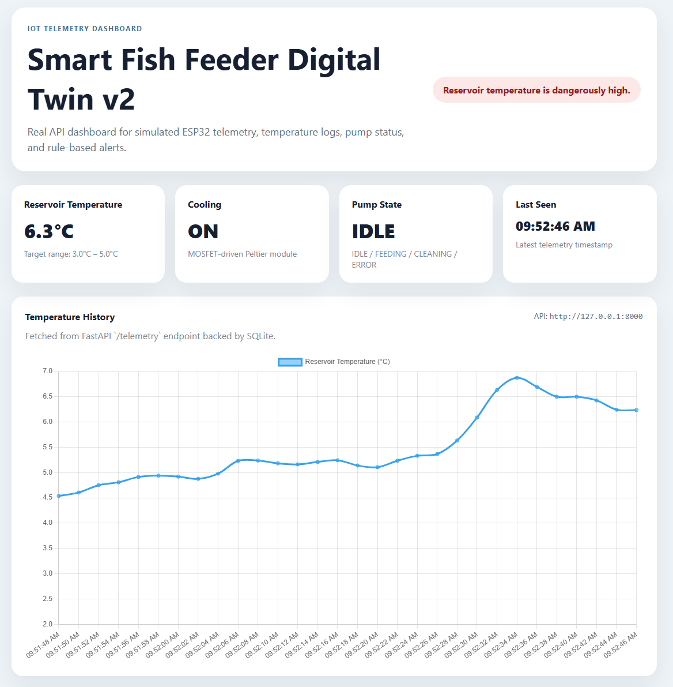
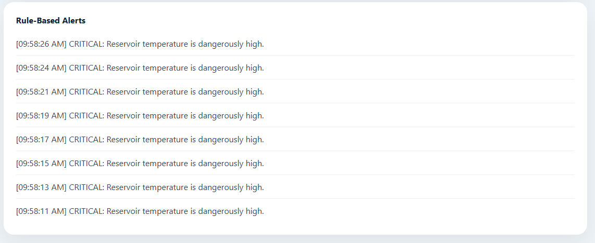

# Smart Fish Feeder Digital Twin v4

[](https://github.com/yyq8548/Smart-fish-feeder-digital-twin/actions/workflows/ci.yml)


An IoT operations platform built around a real temperature-controlled liquid fish-feeder prototype. The project began with Arduino hardware, a DS18B20 sensor, DS1307 clock, L293D-controlled peristaltic pump, Peltier cooling, and 3D-printed parts. It now includes ESP32 firmware, Wokwi simulation, MQTT transport, authenticated FastAPI services, durable operational records, automated reliability checks, and a browser dashboard.

## Project overview

- Monitors reservoir temperature, cooling state, pump activity, sensor health, and device connectivity in real time
- Runs scheduled or manual feeding cycles, reverse-pump cleaning, cooling control, and missed-feeding detection
- Connects physical ESP32 hardware, the Wokwi simulation, and mock devices through signed MQTT messages or authenticated HTTP telemetry
- Provides a FastAPI service for device provisioning, key rotation, feeding schedules, remote commands, alerts, acknowledgements, and operational history
- Stores devices, telemetry, schedules, feeding executions, alerts, and command lifecycle records in SQLite with Alembic-managed schema migrations
- Handles unreliable IoT delivery with idempotency keys, monotonic event ordering, timestamp validation, heartbeats, bounded retries, and command replay protection
- Includes an authenticated browser control board for selected-device telemetry, alert activity, command history, and confirmed feed, clean, and cooling controls
- Uses automated backend, frontend, firmware, security, migration, and full-stack container checks to verify the complete system

## Architecture

```text
Physical ESP32 / Wokwi ESP32 / Mock client
                  |
             MQTT or HTTP
                  v
          Mosquitto + bridge
                  |
      authenticated / idempotent
                  v
             FastAPI v4
       +----------+----------+
       |                     |
  SQLAlchemy/Alembic     JSON logs + alerts
       |                     |
  persistent SQLite     reliability scanner
       |
       v
 Nginx dashboard + REST/Swagger API
```

## Implemented capabilities

### Device and telemetry

- Wokwi-compatible ESP32 firmware using WiFi, PubSubClient, and DS18B20
- Cooling hysteresis, scheduled/manual feeding, and reverse-pump cleaning
- MQTT-to-HTTP bridge with bounded exponential retry
- Versioned, full-payload HMAC-SHA256 signatures prevent an untrusted broker client from changing sensor or feeding data before the bridge authenticates it
- Per-device API keys, sequence numbers, idempotency keys, UTC event time, and sensor health
- Duplicate delivery protection and explicit rejection of stale, future, or out-of-order telemetry

### Operations

- Device provisioning and credential rotation
- Feeding-schedule CRUD with IANA timezones and configurable grace periods; date-scoped idempotency limits each schedule to one command per local day
- Feeding execution history and automatic missed-feeding detection
- Durable temperature, pump, sensor, offline, and missed-feeding alerts
- Operator alert acknowledgement
- `FEED_NOW`, `CLEAN_PUMP`, and `SET_COOLING` command lifecycle APIs with typed/size-bounded payloads, idempotency keys, atomic claims, short delivery deadlines, expiring leases, signed MQTT delivery, and signed completion results
- Online-device interlocks and a 500–60,000 ms duration range prevent the web console from queuing stale manual actuation; the forward-feed and standalone clean phases default to 1,000 ms
- Reboot-safe command replay protection: the ESP32 persists the highest accepted command ID in NVS before physical actuation

### Delivery and verification

- Non-root backend, dashboard, and bridge containers
- Database volume and service health checks
- Production profile with HTTPS, TLS MQTT, per-device broker ACLs, automatic certificates, strong-secret validation, and no public backend/broker plaintext ports
- Full-stack Compose smoke test covering migrations, login, device provisioning, invalid credentials, HTTP ingestion, MQTT delivery, dashboard serving, and Nginx API proxying
- Python and JavaScript vulnerability audits on every pull request
- 47 backend tests, 13 focused MQTT transport/bridge tests, and 20 frontend tests

## Demos

- [Original physical prototype video](https://drive.google.com/file/d/1-BNHRS8WrIlX6UmlVeAYz3xfRProdbw3/view?usp=sharing)
- [Original Arduino/Wokwi control simulation](https://wokwi.com/projects/468425567572330497)
- [ESP32 MQTT simulation instructions](simulation/esp32-mqtt/README.md)




## One-command setup

Requirements: Docker with Compose v2.

```bash
cp .env.example .env
docker compose up --build
```

Then open:

- Dashboard: <http://localhost:8080>
- API: <http://localhost:8000>
- Swagger UI: <http://localhost:8000/docs>

Sign in to the local control board with `admin` and
`local-development-admin-password` unless those values were replaced in
`.env`. Operational reads and all commands require the short-lived operator
token returned by the login endpoint.

The defaults are for local demonstration only. Host ports bind to loopback, including the anonymous development MQTT broker. Replace every value in `.env` and use an authenticated TLS broker before connecting hardware over a LAN or exposing any service outside your computer.

Run the exact end-to-end CI smoke test locally with:

```bash
bash scripts/compose-smoke.sh
```

## Online control of a physical feeder

The production profile exposes the dashboard/API over HTTPS and a
device-authenticated MQTT endpoint over TLS port 8883 while keeping the API,
dashboard container, bridge, and plaintext broker listener private:

```bash
cp .env.production.example .env.production
chmod 600 .env.production
docker compose --env-file .env.production -f docker-compose.production.yml config --quiet
docker compose --env-file .env.production -f docker-compose.production.yml up -d --build
```

Before deploying, follow [the single-VPS cloud guide](docs/cloud_deployment.md).
Before connecting the pump or Peltier module, follow [the ESP32 wiring map](docs/wiring.md#networked-esp32-control-wiring)
and [physical commissioning procedure](docs/physical_commissioning.md). The
original Arduino Mega sketch remains an offline prototype; the active cloud
path requires the ESP32 firmware.

## Local backend development

```powershell
py -3.11 -m venv .venv
.\.venv\Scripts\python.exe -m pip install -r backend\requirements-dev.txt -r mock_device\requirements.txt

cd backend
..\.venv\Scripts\alembic.exe upgrade head
..\.venv\Scripts\python.exe -m uvicorn main:app --reload
```

Start the direct HTTP simulator in another terminal:

```powershell
$env:DEVICE_API_KEY = "local-development-key"
.\.venv\Scripts\python.exe mock_device\mock_esp32_client.py
```

## Authentication workflow

Operators authenticate at `POST /auth/token`. A bearer token is required to read operational telemetry/status/alerts, provision devices, rotate keys, manage schedules, acknowledge alerts, issue commands, and run an immediate reliability scan.

Devices send both headers on ingestion and command calls. The bridge supports one device through `DEVICE_UID`/`DEVICE_API_KEY` or multiple explicitly allowlisted devices through matching `DEVICE_CREDENTIALS_JSON` and `MQTT_SHARED_SECRETS_JSON` maps. Compose passes these values through from `.env`:

```text
X-Device-ID: feeder-001
X-Device-Key: <device key>
```

Provisioned device keys are returned once; only a keyed SHA-256 digest is stored. Operator passwords are hashed with Argon2.

## Telemetry contract

```json
{
  "device_uid": "feeder-001",
  "idempotency_key": "mqtt-a1b2c3d4-1783773296000123",
  "sequence_number": 1783773296000123,
  "recorded_at": "2026-07-11T12:34:56Z",
  "temperature_c": 4.6,
  "cooling_on": false,
  "pump_state": "IDLE",
  "sensor_status": "OK",
  "event_type": "heartbeat"
}
```

When the temperature sensor is disconnected, `temperature_c` is `null` and `sensor_status` is `DISCONNECTED`; the backend creates a critical durable alert.

## Main APIs

| Area | Endpoints |
| --- | --- |
| Authentication | `POST /auth/token`, `GET /users/me` |
| Devices | `POST/GET /devices`, `POST /devices/{uid}/rotate-key` |
| Telemetry | `POST/GET /telemetry`, `GET /device-status` |
| Schedules | `POST/GET /devices/{uid}/schedules`, `PATCH/DELETE /schedules/{id}` |
| Operations | `GET /feeding-executions`, `GET /alerts`, `POST /alerts/{id}/acknowledge` |
| Commands | `POST/GET /devices/{uid}/commands`, `POST /device-commands/claim`, `POST /device-commands/{id}/complete` |
| Reliability | `POST /reliability/scan` plus automatic schedule dispatch and missed/offline scanning |

## Quality gates

```powershell
.\.venv\Scripts\ruff.exe format --check .
.\.venv\Scripts\ruff.exe check .
.\.venv\Scripts\mypy.exe
.\.venv\Scripts\pytest.exe
.\.venv\Scripts\pip-audit.exe -r backend\requirements-dev.txt -r mock_device\requirements.txt

cd dashboard
pnpm install --frozen-lockfile
pnpm lint
pnpm test
pnpm audit
```

## Repository map

```text
backend/                 FastAPI app, Alembic migrations, tests, Dockerfile
dashboard/               Nginx-served JavaScript dashboard and Vitest suite
firmware/esp32_mqtt/     Networked ESP32 firmware
firmware/sketch.ino      Preserved original Arduino Mega firmware
simulation/esp32-mqtt/   Wokwi ESP32 wiring and setup
mock_device/             HTTP simulator and MQTT-to-HTTP bridge
scripts/                 End-to-end Compose smoke test
deploy/                  Production proxy, broker ACL, and startup validation
docs/                    Architecture, API, deployment, wiring, and commissioning notes
docker-compose.yml       Complete local system
docker-compose.production.yml  HTTPS + TLS-MQTT single-VPS profile
```

## Honest deployment boundaries

- SQLite and the in-process rate limiter fit a small single-instance deployment; a horizontally scaled deployment should use PostgreSQL and a shared Redis-backed limiter.
- The public MQTT settings in the Wokwi guide are for nonsensitive demos. The Compose broker is intentionally loopback-only; production or LAN hardware should use a private TLS broker and broker credentials.
- The ESP32 sketch is compiled by CI and exercised through contract tests, but it has not been bench-tested against the physical feeder.
- The RAM telemetry queue tolerates short outages but does not survive device power loss.
- The production profile is a single-VPS design without automatic failover.

These boundaries are documented engineering tradeoffs rather than claims that the prototype is production-certified hardware.
