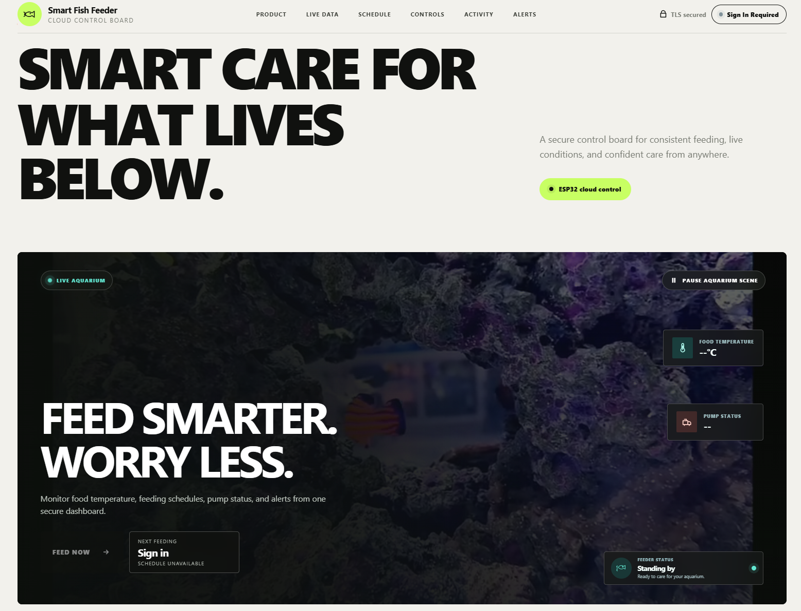
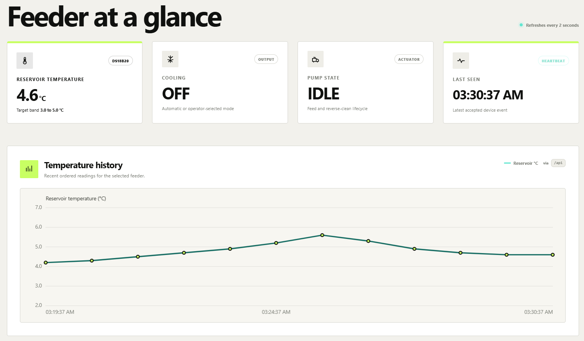
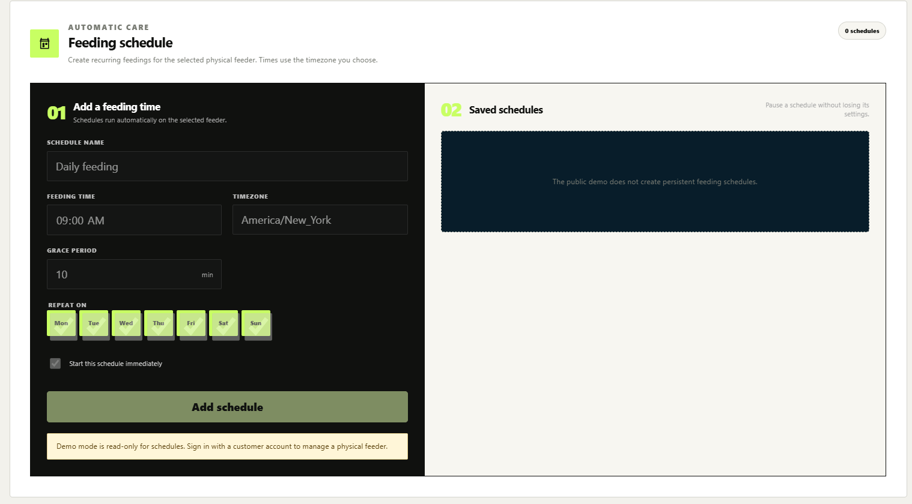
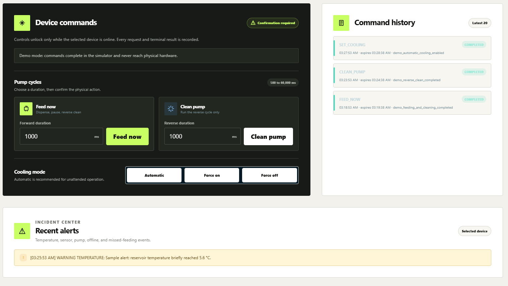

# Smart Fish Feeder

> A secure cloud control board for a physical ESP32 liquid-food feeder

[](https://github.com/yyq8548/Smart-fish-feeder-digital-control/actions/workflows/ci.yml)


**Feed smarter. Worry less.**

This project solves a practical problem for aquarium hobbyists who need to keep liquid food cool, deliver consistent meals while away, and prevent food from remaining in the pump line. A physical ESP32 feeder reports live telemetry to the cloud, accepts authenticated commands, dispenses food, reverses the pump to clean the tube, and reports the final result back to the website.

The repository contains the complete system: responsive web dashboard, FastAPI control service, persistent database, authenticated MQTT/TLS broker, ESP32 firmware, automated tests, and a Docker-based production deployment.

| Monitor | Automate | Control | Verify |
| --- | --- | --- | --- |
| Reservoir temperature, pump state, cooling output, heartbeat | Timezone-aware recurring feeding schedules | Feed now, clean pump, automatic or forced cooling | Signed device results, command history, alerts, and audit records |

**Quick links:** [Live dashboard](https://feeder.smartfishfeeder.org) · [Physical demo](https://youtu.be/YY09H4AA6kg) · [User manual](#website-user-manual) · [Command flow](#how-a-command-reaches-the-feeder) · [Production deployment](#production-deployment)

## Live system

**Control board:** [feeder.smartfishfeeder.org](https://feeder.smartfishfeeder.org)

**Physical device video:**

[](https://youtu.be/YY09H4AA6kg)

The website includes a public, isolated demo with realistic sample telemetry and simulated device controls:

```text
username: demo
password: smartfishdemo
```

Select **Try demo** on the sign-in panel for one-click access. The demo account cannot view production devices or telemetry, provision hardware, rotate credentials, modify schedules, acknowledge production alerts, run reliability jobs, or send commands to the physical ESP32. Production usernames, passwords, device credentials, and signing secrets remain private.

## Product tour

### Cloud control for the physical feeder

[](https://feeder.smartfishfeeder.org)

The landing experience connects the aquarium scene to the operational dashboard while keeping sign-in state, device health, and the next feeding visible.

### Live telemetry and temperature history



The control board refreshes device telemetry every two seconds and presents reservoir temperature, cooling output, pump state, last heartbeat, and ordered temperature history at a glance.

### Recurring feeding schedules



Authenticated customers can create recurring schedules for selected weekdays, choose the feeder's timezone and grace period, and pause or delete saved schedules. The public demo presents this workflow in read-only mode.

### Device controls, results, and alerts



Manual commands require confirmation. Every request receives a durable lifecycle record, and the dashboard separates pending work from signed completion results returned by the ESP32.


## Website user manual

### Customer sign-up and device pairing

1. Select **Create account**, enter an email address, and choose a password with at least 12 characters, uppercase, lowercase, and a number.
2. Open the time-limited verification link sent by the control board, then sign in with the verified email address.
3. Scan the feeder QR code or enter the device UID and one-time pairing code supplied with the physical feeder.
4. Confirm that the feeder appears under **Selected device**. Until a feeder is paired, the account stays empty and physical controls remain disabled.

Each customer can see and control only devices paired to their account. Pairing consumes the code so it cannot be reused. **Remove selected feeder from this account** detaches the feeder and returns a replacement one-time code for a controlled transfer. The **Forgot password?** flow sends a single-use reset link without revealing whether an email address is registered.

### 1. Sign in

1. Open [the live control board](https://feeder.smartfishfeeder.org).
2. Select **Try demo** for the public simulator, sign in with a verified customer email, or enter private operator credentials supplied by the system owner.
3. Select **Sign in** when using manually entered credentials.
4. Confirm that the header changes from **Sign In Required** to the current system state.

The browser exchanges the credentials for a short-lived access token. The token is kept only in the current browser tab and is removed when the operator signs out.

### 2. Select a feeder

Use **Selected device** to choose the feeder you want to monitor or operate. Every metric, chart, alert, command, and history entry on the page is filtered to that device.

Always verify the selected device UID before issuing a physical command.

### 3. Check device status

Review the four status cards before operating the feeder:

| Card | Meaning |
| --- | --- |
| Reservoir Temperature | Latest accepted DS18B20 reading |
| Cooling | Current cooling output state |
| Pump State | `IDLE`, `FEEDING`, `CLEANING`, or `ERROR` |
| Last Seen | Time of the latest accepted device event |

The **Temperature History** chart shows recent ordered telemetry. An offline banner or stale **Last Seen** value means actuator controls will remain disabled.

### 4. Create a feeding schedule

1. Select **Schedule** in the top navigation.
2. Enter a descriptive schedule name and feeding time.
3. Confirm the IANA timezone, such as `America/New_York`.
4. Choose the weekdays on which the schedule should run.
5. Set a grace period between `1` and `180` minutes.
6. Keep **Start this schedule immediately** selected, then choose **Add schedule**.

Saved schedules can be paused, re-enabled, or deleted without changing other feeder settings. Schedules belong to the selected physical feeder, so verify the device before saving. The public demo is intentionally read-only and does not create persistent schedules.

### 5. Feed now

1. Confirm that the selected device is online and its pump state is `IDLE`.
2. Enter a feed duration between `500` and `60,000` milliseconds.
3. Select **Feed now**.
4. Read the confirmation dialog carefully and approve it.
5. Watch **Command history** for the final result.

The ESP32 runs the pump forward to dispense food, pauses for safety, reverses the pump to clean the tube, and then returns to idle.

### 6. Clean the pump

1. Confirm that the mechanism can operate safely.
2. Enter a cleaning duration between `500` and `60,000` milliseconds.
3. Select **Clean pump** and approve the confirmation dialog.
4. Wait for a terminal command result before sending another pump command.

The cleaning command operates the pump in reverse without running a complete feeding cycle.

### 7. Change cooling mode

Choose one of the following controls and confirm the request:

| Website control | Behavior |
| --- | --- |
| Automatic | ESP32 manages cooling with the configured temperature hysteresis |
| Force on | Enables the cooling output continuously |
| Force off | Disables the cooling output continuously |

Use forced modes only for supervised operation. Return the device to **Automatic** for normal unattended temperature control.

### 8. Read command history

Every accepted request is recorded with its command type, creation time, expiration time, status, and device result.

| Status | Meaning |
| --- | --- |
| `PENDING` | Stored by the cloud and waiting for the device |
| `CLAIMED` | Delivered to and accepted by the device |
| `COMPLETED` | Physical operation finished successfully |
| `FAILED` | Device rejected or could not complete the operation |
| `EXPIRED` | Device did not claim the command before its deadline |

Do not assume that an accepted command completed. Wait for `COMPLETED` and read the result text.

### 9. Review alerts

The **Recent alerts** panel displays temperature, sensor, pump, offline, and missed-feeding incidents. Check the timestamp, severity, category, and message before taking action. Resolve the physical cause before repeating a failed command.

### 10. Sign out

Select **Sign out** when finished, especially on a shared computer. Closing the browser tab also removes the in-tab session token.

## What the website controls

| Dashboard action | Cloud command | ESP32 behavior | Expected result |
| --- | --- | --- | --- |
| Scheduled feeding | Due schedule execution | Signed feed command at the configured local time | Recorded execution and terminal result |
| Feed now | `FEED_NOW` | Pump forward, safety pause, reverse clean, idle | Completed or failed feeding cycle |
| Clean pump | `CLEAN_PUMP` | Pump reverse for the requested duration | Completed or failed cleaning cycle |
| Automatic cooling | `SET_COOLING: AUTO` | Temperature-controlled cooling | Automatic mode enabled |
| Force cooling on | `SET_COOLING: FORCED_ON` | Cooling driver enabled | Output enabled |
| Force cooling off | `SET_COOLING: FORCED_OFF` | Cooling driver disabled | Output disabled |

The backend also supports missed-feeding detection, alert acknowledgement, credential rotation, and device provisioning through its authenticated API.

### What the public demo includes

| Demo feature | What visitors can see or do |
| --- | --- |
| Simulated feeder | One online device named **Public Demo Feeder** with UID `demo-feeder-001` |
| Sample telemetry | 12 generated reservoir readings from 4.2 &deg;C to 5.6 &deg;C, including cooling and pump-state changes |
| Sample alert | A resolved warning showing how a 5.6 &deg;C temperature excursion appears |
| Command history | Completed automatic-cooling, pump-cleaning, and feeding examples |
| Interactive controls | Submit feed, clean, and cooling commands and immediately see a simulated `COMPLETED` result |
| Schedule preview | View the complete scheduling interface without creating persistent production schedules |

The public demo is deliberately separated from the physical control path. Its commands are held only in server memory, never written to the production command database, and never published to the MQTT broker. Demo sessions cannot discover real device identifiers or data: production-device reads return `404`, and production mutations return `403`. Synthetic data is regenerated and interactive demo history resets whenever the backend restarts.

> **Demo safety:** A successful demo command proves the website workflow, not that a physical feeder moved. Only a private operator account can issue durable commands to an authenticated ESP32.

| Service | Address | Purpose |
| --- | --- | --- |
| Web control board | `https://feeder.smartfishfeeder.org` | Operator monitoring and physical-device controls |
| Health check | `https://feeder.smartfishfeeder.org/health` | Dashboard availability |
| Backend API | `https://feeder.smartfishfeeder.org/api` | Authenticated application API |
| ESP32 broker | `mqtt.smartfishfeeder.org:8883` | Authenticated MQTT over TLS |

## Connect a physical ESP32

The ESP32 connects directly to the production broker over Wi-Fi; it does not need to remain connected to a computer after flashing.

1. Copy `firmware/esp32_mqtt/feeder_secrets.example.h` to `firmware/esp32_mqtt/feeder_secrets.h`.
2. Add the device's Wi-Fi SSID and password.
3. Set the MQTT host to `mqtt.smartfishfeeder.org` and the port to `8883`.
4. Enable verified TLS and keep insecure TLS disabled.
5. Add the provisioned device UID, MQTT username/password, HMAC shared secret, and appropriate trusted root CA.
6. Compile and flash `firmware/esp32_mqtt/esp32_mqtt.ino`.
7. Commission the sensor first, then low-voltage outputs, and finally unloaded pump and cooling hardware.
8. Confirm that telemetry appears on the website before enabling actuators.
9. Test every command with the mechanism unloaded and supervised.

Never commit `feeder_secrets.h`. Follow the [physical commissioning checklist](docs/physical_commissioning.md) and [wiring guide](docs/wiring.md#networked-esp32-control-wiring) before connecting powered hardware.

### ESP32 pin map

| ESP32 pin | Connected component | Purpose |
| --- | --- | --- |
| GPIO 4 | DS18B20 | Reservoir temperature |
| GPIO 18 | Local feed button | Offline/manual feed input |
| GPIO 25 | Cooling driver | Peltier or cooling relay control |
| GPIO 26 | Pump driver forward | Dispense direction |
| GPIO 27 | Pump driver reverse | Tube-cleaning direction |
| GPIO 33 | Pump enable | Motor-driver enable |

## How a command reaches the feeder

```text
Operator browser
    |
    | HTTPS + short-lived JWT
    v
FastAPI control service -----> SQLite command and audit records
    |
    | signed pending command
    v
MQTT bridge -----> Mosquitto TLS broker -----> ESP32
                                              |
                                              | GPIO
                                              v
                              Pump, cooling driver, sensor

ESP32 ---- signed telemetry and result ----> MQTT bridge ----> FastAPI
                                                              |
                                                              v
                                                       Updated website
```

Commands are short-lived and non-retained. The ESP32 verifies the HMAC-SHA256 signature, expiration time, and monotonic command ID before operating hardware. It stores the accepted-command watermark in NVS so a reboot cannot replay an old feed instruction.

## Safety behavior

- Physical controls are disabled while the selected device is offline.
- Every actuator command requires operator confirmation.
- Feed and cleaning durations are validated by both the website and API.
- Manual commands expire instead of waiting indefinitely for a disconnected device.
- MQTT commands use QoS 1 and are never retained.
- Idempotency and replay protection prevent duplicate actuation.
- Invalid signatures, stale timestamps, expired commands, and out-of-order events are rejected.
- Sensor failure disables automatic cooling and creates an alert.
- The local physical feed button remains available without the website.

Software safeguards do not replace fuses, isolation, current limits, electrical protection, or supervised commissioning.


## Production deployment

The production profile exposes only HTTPS and authenticated MQTT/TLS. The backend, dashboard, bridge, database, and plaintext broker listener remain on private Docker networks.

```bash
cp .env.production.example .env.production
chmod 600 .env.production

docker compose \
  --env-file .env.production \
  -f docker-compose.production.yml \
  config --quiet

docker compose \
  --env-file .env.production \
  -f docker-compose.production.yml \
  up -d --build
```

Replace every placeholder with a unique high-entropy value, configure separate dashboard and MQTT DNS records, and follow the [single-VPS deployment guide](docs/cloud_deployment.md).

## Security and reliability

- Argon2 operator password hashing and short-lived JWT sessions
- Per-device API and MQTT credentials
- HMAC-SHA256 telemetry, command, and result signatures
- TLS certificate and hostname verification
- Per-device MQTT topic ACLs
- Rate limiting, timestamp validation, monotonic ordering, and idempotency
- Durable devices, telemetry, schedules, executions, commands, and alerts
- ESP32 NVS replay protection and terminal-result retry behavior
- Alembic database migrations and container health checks

## Automated verification

GitHub Actions runs the following on every pull request:

- Ruff formatting and linting
- Strict mypy type checking
- 71 Python backend, MQTT transport, account-isolation, and Wokwi contract tests
- 32 dashboard tests covering live, demo, customer onboarding, schedule management, empty, and failed API states
- Browser-driven dashboard-to-Wokwi closed-loop verification
- Python and JavaScript dependency vulnerability audits
- Plaintext and verified-TLS ESP32 firmware compilation
- Wokwi sensor, hysteresis, and pump-cycle simulation when its token is configured
- Development and production Docker configuration validation
- Complete Docker Compose build and end-to-end smoke test

The latest successful CI run measured 89.84% Python coverage and 84.75% dashboard line coverage.

## Main APIs

| Area | Endpoints |
| --- | --- |
| Authentication | `POST /auth/register`, `POST /auth/verify-email`, `POST /auth/token`, password reset, `GET /users/me` |
| Devices | `POST/GET /devices`, `POST /devices/pair`, pairing transfer, `POST /devices/{uid}/rotate-key` |
| Telemetry | `POST/GET /telemetry`, `GET /device-status` |
| Schedules | `POST/GET /devices/{uid}/schedules`, `PATCH/DELETE /schedules/{id}` |
| Operations | `GET /feeding-executions`, `GET /alerts`, `POST /alerts/{id}/acknowledge` |
| Commands | `POST/GET /devices/{uid}/commands`, `POST /device-commands/claim`, `POST /device-commands/{id}/complete` |
| Reliability | `POST /reliability/scan` plus automatic schedule and offline scanning |

## Repository map

```text
backend/                       FastAPI service, database, migrations, tests
dashboard/                     Browser control board and frontend tests
firmware/esp32_mqtt/           Physical ESP32 MQTT/TLS firmware
firmware/sketch.ino            Preserved original Arduino Mega prototype
mock_device/                   Local device simulator and MQTT bridge
simulation/esp32-mqtt/         Wokwi ESP32 virtual hardware
deploy/                        Production proxy, broker, ACL, and health files
docs/cloud_deployment.md       VPS, DNS, TLS, secrets, and operations guide
docs/wiring.md                 ESP32-to-hardware wiring map
docs/physical_commissioning.md Safe physical bring-up procedure
docker-compose.yml             Complete local demonstration stack
docker-compose.production.yml  HTTPS and MQTT/TLS production stack
```

## Additional demonstrations

- [Original Arduino/Wokwi simulation](https://wokwi.com/projects/468425567572330497)
- [ESP32 MQTT simulation instructions](simulation/esp32-mqtt/README.md)
