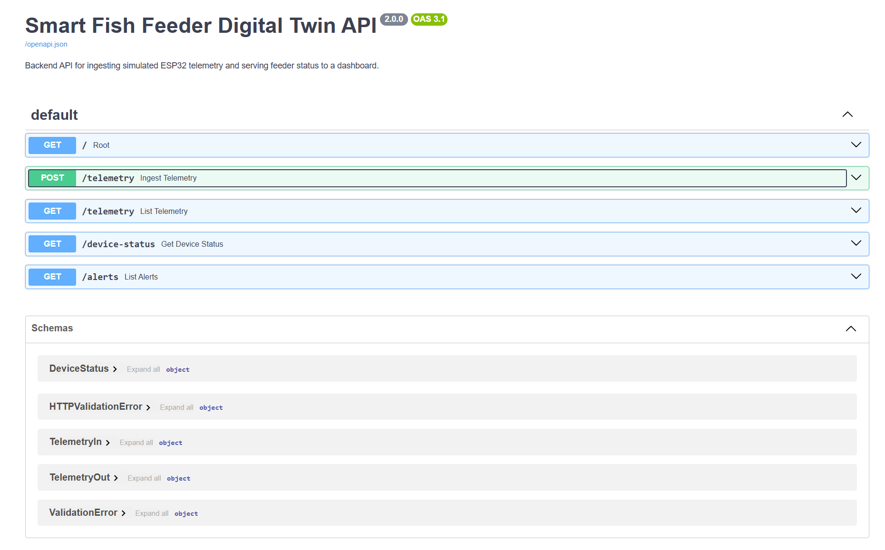

# Smart Fish Feeder Digital Twin v2

A software-oriented upgrade of an Arduino-based automated liquid fish-feeder system.

This project started as a physical embedded-system prototype using an Arduino, DS18B20 temperature sensor, DS1307 RTC module, L293D motor driver, peristaltic pump, MOSFET-driven Peltier cooling, and reverse-pump cleaning logic. It has been upgraded into a digital twin system with a Wokwi simulation, FastAPI telemetry backend, SQLite database, mock ESP32 client, and web dashboard.

---

## Demo

### Live Wokwi Simulation

[Open the Wokwi Arduino simulation](https://wokwi.com/projects/468425567572330497)

The Wokwi simulation demonstrates the embedded control logic for temperature monitoring, RTC-based scheduled dosing, Peltier cooling control, pump actuation, and reverse-pump cleaning.

### Physical Prototype Demo

[Watch the physical fish-feeder demo video](https://drive.google.com/file/d/1-BNHRS8WrIlX6UmlVeAYz3xfRProdbw3/view?usp=sharing)

The physical prototype shows the original automated liquid fish-feeder system with custom housing, pump control, and reservoir-based feeding workflow.

### Dashboard Demo


### FastAPI Backend



---

## Key Features

- Arduino-based embedded control logic for automated liquid feeding
- DS18B20 temperature monitoring for reservoir temperature tracking
- DS1307 RTC-based scheduled dosing
- Peltier cooling control through MOSFET logic
- L293D motor control for pump forward dosing and reverse-pump cleaning
- Wokwi simulation for online embedded-system demonstration
- FastAPI backend for telemetry ingestion and device-status APIs
- SQLite database with SQLAlchemy persistence
- Mock ESP32 telemetry client for simulated IoT data streaming
- Web dashboard for temperature history, pump state, feeding events, and alerts
- Rule-based alerting for abnormal reservoir temperature and pump errors

---

## System Architecture

```text
Physical Prototype / Wokwi Simulation / Mock ESP32 Client
                         |
                         | POST /telemetry
                         v
                  FastAPI Backend
                         |
                         v
                  SQLite Database
                         |
                         v
                  Web Dashboard
```

---

## Project Structure

```text
smart_fish_feeder_digital_twin/
├── backend/
│   ├── main.py
│   ├── requirements.txt
│   └── README.md
├── mock_device/
│   ├── mock_esp32_client.py
│   ├── requirements.txt
│   └── README.md
├── dashboard/
│   ├── index.html
│   ├── style.css
│   ├── app.js
│   └── README.md
├── docs/
│   ├── images/
│   │   ├── dashboard.png
│   │   └── fastapi_docs.png
│   ├── architecture_v2.md
│   └── api_design.md
├── firmware/
│   └── README.md
├── simulation/
│   └── README.md
└── .gitignore
```

---

## Quick Start on Windows PowerShell

### 1. Start the backend

```powershell
cd backend

py -3.11 -m venv .venv
.\.venv\Scripts\python.exe -m pip install --upgrade pip
.\.venv\Scripts\python.exe -m pip install -r requirements.txt
.\.venv\Scripts\python.exe -m uvicorn main:app --reload
```

Backend URL:

```text
http://127.0.0.1:8000
```

API documentation:

```text
http://127.0.0.1:8000/docs
```

---

### 2. Start the mock ESP32 telemetry client

Open a second PowerShell window:

```powershell
cd mock_device

py -3.11 -m venv .venv
.\.venv\Scripts\python.exe -m pip install --upgrade pip
.\.venv\Scripts\python.exe -m pip install -r requirements.txt
.\.venv\Scripts\python.exe mock_esp32_client.py
```

The mock client sends simulated telemetry to the backend every 2 seconds.

Example output:

```text
temp=4.6C cooling=False pump=IDLE alert=normal
temp=5.4C cooling=True pump=IDLE alert=warning
temp=6.2C cooling=True pump=IDLE alert=critical
```

---

### 3. Open the dashboard

Open this file in your browser:

```text
dashboard/index.html
```

The dashboard fetches live data from:

```text
http://127.0.0.1:8000
```

---

## API Endpoints

| Method | Endpoint | Description |
|---|---|---|
| `GET` | `/` | API root and service metadata |
| `POST` | `/telemetry` | Ingest simulated device telemetry |
| `GET` | `/telemetry` | Return recent telemetry history |
| `GET` | `/device-status` | Return the latest device status |
| `GET` | `/alerts` | Return warning and critical alerts |

---

## Example Telemetry Payload

```json
{
  "temperature_c": 4.6,
  "cooling_on": false,
  "pump_state": "IDLE",
  "event_type": null
}
```

Example response:

```json
{
  "id": 1,
  "temperature_c": 4.6,
  "cooling_on": false,
  "pump_state": "IDLE",
  "event_type": null,
  "alert_level": "normal",
  "alert_message": null,
  "created_at": "2026-07-02T13:00:00Z"
}
```

---

## Rule-Based Alerts

The backend assigns alert levels based on incoming telemetry:

| Condition | Alert Level | Message |
|---|---|---|
| `pump_state == "ERROR"` | Critical | Pump reported an error state |
| `temperature_c >= 6.0` | Critical | Reservoir temperature is dangerously high |
| `temperature_c > 5.0` | Warning | Reservoir temperature is above target range |
| `temperature_c < 2.5` | Warning | Reservoir temperature is below target range |
| Otherwise | Normal | No active alert |

---

## Tech Stack

| Layer | Tools |
|---|---|
| Embedded simulation | Arduino, Wokwi |
| Sensor/control logic | DS18B20, DS1307 RTC, L293D, MOSFET/Peltier control |
| Backend | FastAPI, Pydantic |
| Database | SQLite, SQLAlchemy |
| Mock IoT client | Python, Requests |
| Frontend dashboard | HTML, CSS, JavaScript, Chart.js |
